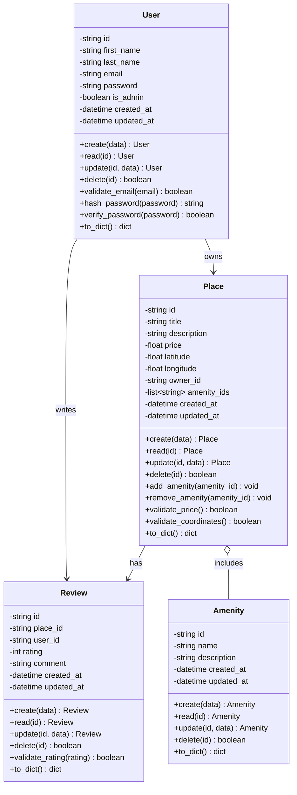

```mermaid
classDiagram
    direction TB
    
    %% Classe User
    class User {
        -string id
        -string first_name
        -string last_name
        -string email
        -string password
        -boolean is_admin
        -datetime created_at
        -datetime updated_at
        
        +create(data) User
        +read(id) User
        +update(id, data) User
        +delete(id) boolean
        +validate_email(email) boolean
        +hash_password(password) string
        +verify_password(password) boolean
        +to_dict() dict
    }
    
    %% Classe Place
    class Place {
        -string id
        -string title
        -string description
        -float price
        -float latitude
        -float longitude
        -string owner_id
        -list~string~ amenity_ids
        -datetime created_at
        -datetime updated_at
        
        +create(data) Place
        +read(id) Place
        +update(id, data) Place
        +delete(id) boolean
        +add_amenity(amenity_id) void
        +remove_amenity(amenity_id) void
        +validate_price() boolean
        +validate_coordinates() boolean
        +to_dict() dict
    }
    
    %% Classe Review
    class Review {
        -string id
        -string place_id
        -string user_id
        -int rating
        -string comment
        -datetime created_at
        -datetime updated_at
        
        +create(data) Review
        +read(id) Review
        +update(id, data) Review
        +delete(id) boolean
        +validate_rating(rating) boolean
        +to_dict() dict
    }
    
    %% Classe Amenity
    class Amenity {
        -string id
        -string name
        -string description
        -datetime created_at
        -datetime updated_at
        
        +create(data) Amenity
        +read(id) Amenity
        +update(id, data) Amenity
        +delete(id) boolean
        +to_dict() dict
    }
    
    %% Relations sans cardinalités
    User --> Place : owns
    User --> Review : writes
    Place --> Review : has
    Place o-- Amenity : includes
```