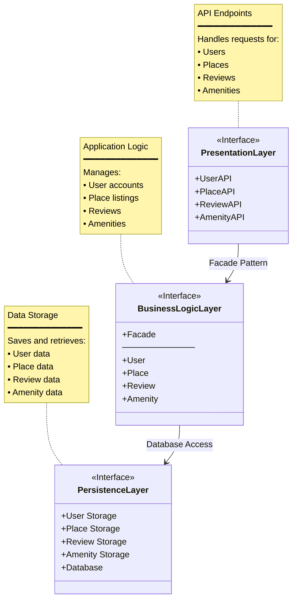

```mermaid
classDiagram
direction TB

class PresentationLayer {
    <<Interface>>
    +UserAPI
    +PlaceAPI
    +ReviewAPI
    +AmenityAPI
}
  
class BusinessLogicLayer {
    <<Interface>>
    +Facade
    ────────────
    +User
    +Place
    +Review
    +Amenity
}
  
class PersistenceLayer {
    <<Interface>>
    +User Storage
    +Place Storage
    +Review Storage
    +Amenity Storage
    +Database
}
  
note for PresentationLayer "API Endpoints<br/>━━━━━━━━━━━━━━<br/>Handles requests for:<br/>• Users<br/>• Places<br/>• Reviews<br/>• Amenities"
  
note for BusinessLogicLayer "Application Logic<br/>━━━━━━━━━━━━━━<br/>Manages:<br/>• User accounts<br/>• Place listings<br/>• Reviews<br/>• Amenities"
  
note for PersistenceLayer "Data Storage<br/>━━━━━━━━━━━━━━<br/>Saves and retrieves:<br/>• User data<br/>• Place data<br/>• Review data<br/>• Amenity data"
  
PresentationLayer --> BusinessLogicLayer : Facade Pattern
BusinessLogicLayer --> PersistenceLayer : Database Access
```