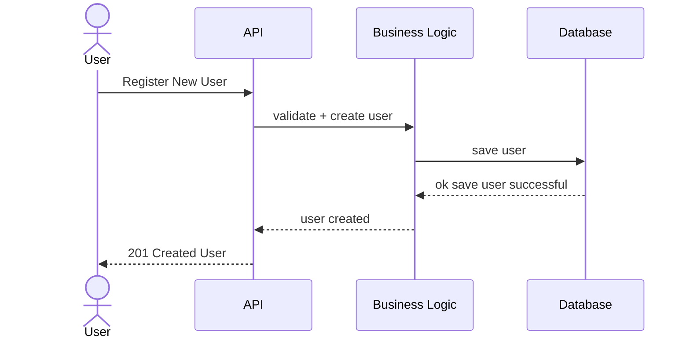
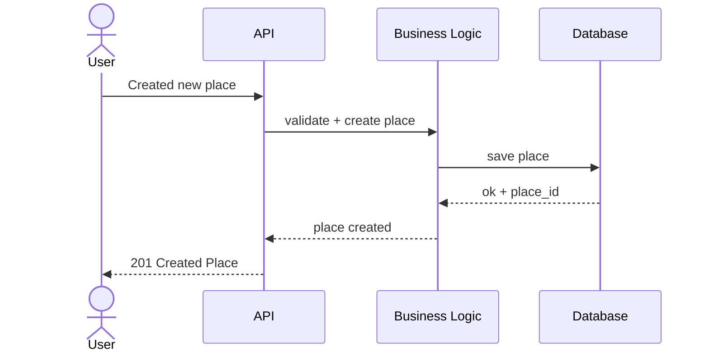
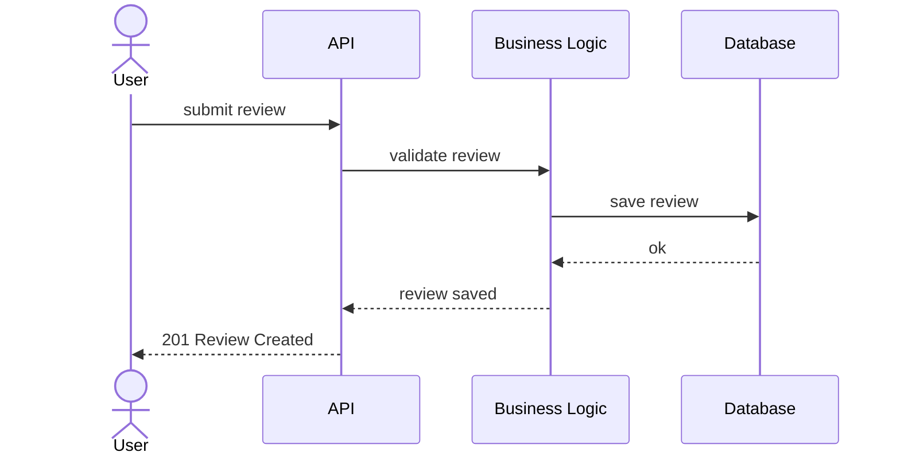
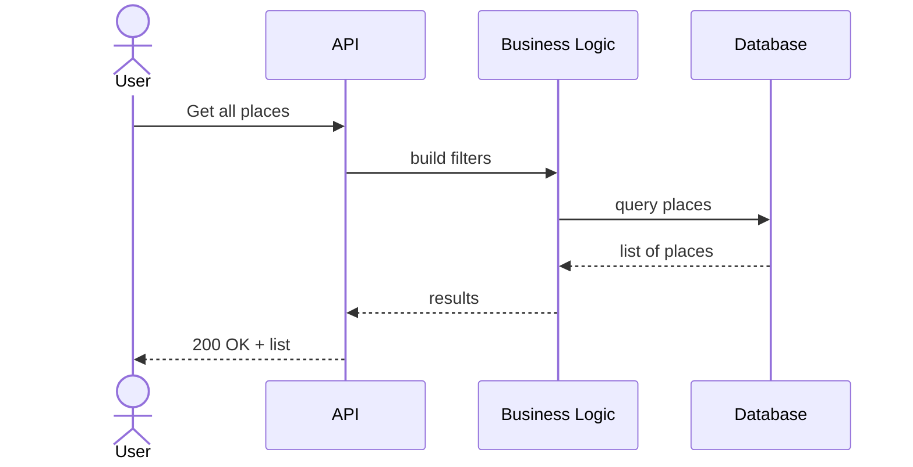

```mermaid
sequenceDiagram
actor User as User
participant API as API 
participant Logic as Business Logic
participant DB as Database

User->>API: Register New User
API->>Logic: validate + create user
Logic->>DB: save user
DB-->>Logic: ok save user successful
Logic-->>API: user created
API-->>User: 201 Created User
```

```mermaid
sequenceDiagram
actor User as User
participant API as API
participant Logic as Business Logic
participant DB as Database

User->>API:Created new place
API->>Logic: validate + create place
Logic->>DB: save place
DB-->>Logic: ok + place_id
Logic-->>API: place created
API-->>User: 201 Created Place
```

```mermaid
sequenceDiagram
actor User as User
participant API as API 
participant Logic as Business Logic
participant DB as Database

User->>API:submit  review
API->>Logic: validate review
Logic->>DB: save review
DB-->>Logic: ok
Logic-->>API: review saved
API-->>User: 201 Review Created
```

```mermaid
sequenceDiagram
actor User as User
participant API as API
participant Logic as Business Logic
participant DB as Database

User->>API: Get all places
API->>Logic: build filters
Logic->>DB: query places
DB-->>Logic: list of places
Logic-->>API: results
API-->>User: 200 OK + list
```